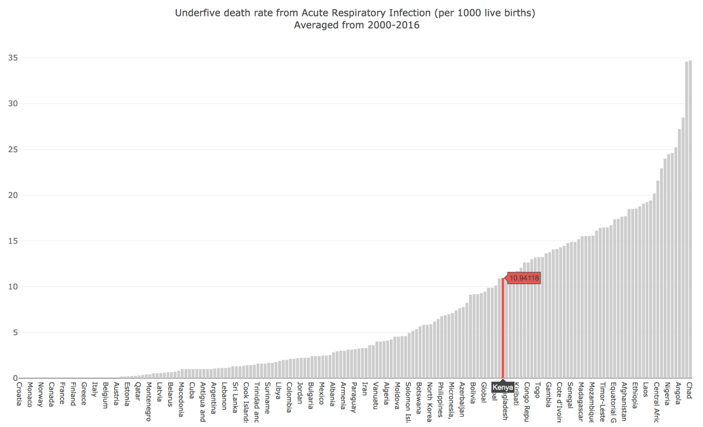

## Functional Specifications
 
### Background

Respiratory syncytial virus (RSV) is a common respiratory virus that, in healthy adults, usually causes an illness similar to the common cold. However, in infants and the elderly, RSV infection causes severe disease. RSV is the leading cause of pneumonia in infants less than one year of age and is a leading cause of hospitalization due to acute respiratory tract infections in both infants and young children. 

Similar to other respiratory viruses, such as influenza, RSV circulates globally and with distinct seasonality. RSV generally circulates in the winter months in temperate climates and during the monsoon season in the tropics. Additionally, RSV has two distinct subtypes - A and B - and several genotypes. In any given location, it is generally thought that a single subtype will dominate the RSV season and that the dominant subtype cycles overtime with RSV A seasons giving way to RSV B seasons and vice versa. Furthermore, within each subtype, RSV genotypes appear to replace each other over time. Whether this evolution is due to selection from immune pressure or genetic drift is not fully understood, but RSV does appear to have a distinct pattern of infection over space and time, at least at the local level. A larger analysis of RSV sequencing data to look at patterns of subtype cycling and genotype replacement at a global level is lacking and would be an important resource to better understand the evolution and overarching dynamics of this important respiratory virus. 

Furthermore, it is known that for some respiratory viruses, such as rhinovirus, different subtypes or genotypes have different clinical severities. As such, we aim to examine if the subtype and genotype of RSV circulating in a particular location correlates with disease severity as determined by the number of children under 5 years old that die due to acute respiratory tract infection (ARTI). We realize that using deaths due to ARTI in children under 5 is an imperfect estimate of RSV disease burden, but believe this to be an appropriate surrogate due to the high RSV disease burden in this age group. Any large effects of genotype on disease severity should be noticeable with this coarse grain analysis.

Together our project, `RSView`, will provide an important resource for better understanding the global circulation dynamics of RSV and investigating the effects of genotype on disease severity. We recognize that this is very much a "first-pass" analysis, but believe these analyses and, especially, this framework for examining RSV (which is modeled off of the nextstrain.org platform developed by Trevor Bedford and Richard Neher) could prove quite useful for the field.

### Data Sources

RSView utilizes publicly available viral sequence data and metadata from
[GenBank](https://www.ncbi.nlm.nih.gov/genbank/). This data is downloaded in .fasta format. Specifically, the genetic
sequences of >18,000 RSV viruses are used to infer genotype and subtype based on the viral G protein.
Metadata that associated with these sequences is used to locate the virus temporally and geographically. The data on
childhood deaths due to pneumonia is taken from [UNICEF](https://data.unicef.org/topic/child-health/pneumonia/). This
data is available in tabular format.

## User Profile 

### Target user description

RSView is intended to be used by clinicians and laboratory scientists.

We expect clinicians will be interested in using RSView to understand how certain genotypes and subtypes of RSV may
correlate with disease severity and deaths due to other respiratory infections, such as pneumonia. Clinicians may be
interested in comparing these health metrics in their geographic region to those in disparate regions where the same
subtypes of RSV have circulated. To do this, clinicians would use RSView's interactive map to determine the most
prevalent subtypes of RSV in their region and what other locations have seen this subtype. Clinicians would also use the
RSV subtype/childhood pneumonia death analyses to compare health outcomes in their country to these other regions.

Laboratory scientists studying RSV or similar viruses may be interested in RSView as a method for understanding how
viral diversity is distributed globally and how it fluctuates over time. Scientists studying RSV may primarily use
RSView's interactive map as a preliminary tool for understanding and visualizing evolution of RSV. Scientists studying
related viruses may be interested in adapting RSView to visualize the global and temporal distribution of their virus of
interest. 

### Required programming background of users

RSView is an analysis of the global distribution of RSV subtypes intended for laboratory scientists and clinicians. In
order to access the RSView, users will navigate to the Github repository where it is stored
(https://github.com/khdusenbury/viralseq_mapping). Though some of the intended users will have a programming background,
this is not necessary in order for the user to understand or interact with the analysis. Users that are fluent in Python
will be able to view the code used to generate the interactive subtype distribution map, plots of correlations between
RSV subtypes and childhood deaths, and other analyses. 

## Use Cases

### Use Case 1: Analyze global distribution of RSV genotypes or subtypes

Using map_rsv.py, the user can generate a world map highlighting which genotypes and subtypes were found in different countries and their prevalence, as shown by larger circles to represent where more sequences have been recorded. Using the optional 'years' argument or the slider found below the map, the user can highlight which genotypes or subtypes were more prevalent in a given time period or follow their shift in frequency and location over time.

### Use Case 2: Analyze health impact of acute respiratory infections around the world

Using plot_rsv.py, the user can plot different metrics measuring the differential health impact of acute respiratory infections on children around the world. If they are interested in seeing how a particular country compares to the other countries in this dataset, they can use the optional 'highlight_country' to highlight their country of interest on the graph.

### Use Case 3: Analyze health impact trends in a specific country over time

If the user would like to examine health trends in their country of interest more specifically, plot_rsv.py can also be used to plot the trend in health metrics for that country from 2000-2016.
